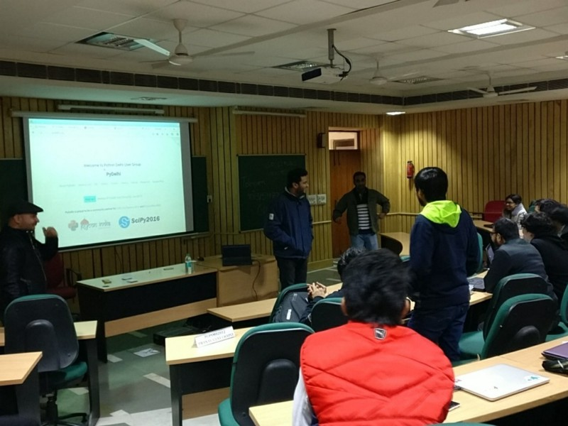

Title: PyDelhi Meetup, The Tale Of 21st January 
Date: 2017-01-24
Modified: 2018-02-03
Category: Meetup
Tags: Telegram, Bots, Python, PyDelhi, Meetup
Slug: PyDelhi-Meetup-The-Tale-Of-21st-January-2017
Authors: Shashank Kumar
Summary: PyDelhi meetup report of 21st January 2017 which also holds account of my first PyDelhi talk.
Cover: images/0*4nilE4nfQA3ACwoE.jpeg

Just like a regular-alternate Saturday, 21st was planned to have [PyDelhi](https://pydelhi.org/) meetup and this time, our host was IIM Lucknow Campus Noida. I reached at around 12 PM near the main gate with my friends. The schedule as on [PyDelhi’s Meetup Page](https://www.meetup.com/pydelhi/) promised a yet another exciting session. Minutes after people started arriving, [Akshay](https://github.com/akshayaurora), one of PyDelhi’s organiser welcomed everyone. You can think of Akshay as ‘the magnificent one’ among the other volunteers of this organisation who make these events possible. Shortly after that he asked the audience to volunteer for the lightning talk, a quick python related talk/session on which they’re currently working on.

##### My Lightning Talk On Python Telegram Bot

Before the event began I hurtled towards Akshay and said “I did something last night and I wanna talk about it”, by these words in mind I raised my hand for lighting talk afterwards.

Just before that night I worked on Python Telegram Bot, a package which can be used very easily in production to create scripts for Telegram Bot. I began with the basic elements of this package and made PyDelhi Bot and hosted it on AWS Cloud. I showed how telegram.ext and telegram modules and its methods can be used to read client’s message and reply with appropriate message. This bot can be accessed by searching ‘pydelhibot’ on telegram and is already serving links on PyDelhi volunteer group. Hence, it became my first talk on PyDelhi after attending meetup for nearly 6 months.

##### Amit Kumar With His GIL Swag

After I finished with my beginner talk it was time for [Amit Kumar](https://medium.com/u/66cd0c98f4e4) to take the floor and share his knowledge on core Python. So he began by first explaining how variables and their values are handled by Python interpreter with the concept of reference count. Moving forward he then showed us the changes to execution time with or without multi-threading and the results were astonishing in which multi-threading lost. Amit explained how Global Interpreter Lock is responsible for such results and it’s bringing down the performance of threads. He then talked about the famous GIL patch in which Greg Stein removed GIL altogether but it decreased performance of Python by 30x. But GIL holds its place until there someone from Python software foundation comes with a better alternative without compromising performance.

##### VIM’s Power Show By Garvit Khatri

[Garvit](https://github.com/garvitdelhi) volunteered for another lightning talk and proposed VIM for this. He began by firing his editor and using commands to quickly navigate between words and lines. By increasing pace, he then showed us how we can mimic an entire set of operation as many times as we want. After then he showed how we can split the terminal window to open multiple files and left us with WOW. VIM is powerful when used at it’s best and can leave any high end editor like sublime or atom behind by just considering the use of shortcuts.

##### Snacks And Venue Sighting For PyDelhi Conference

After Amit’s parody of GIL and Garvit’s showcase of VIM’s abilities came the time for snacks and networking. But for the volunteer it was more important than that. PyDelhi Conference is scheduled on March 18 and IIM itself is the venue for the event so we looked at the proposed halls and buildings to plan further. On the other hand website designs was also discussed.

##### A Brief On The Activities Of IIM’s Incubation

Rajiv Ornsheeba, the Head Of Incubator gave a quick talk on the works of IIM Lucknow Noida Campus. He described the complete procedure about how to apply and what kind of startups they are looking for. He also stated the importance of making revenue around the products we make and how his team can help startups achieve that right from the investments and throughout the journey with the help of professionals.

##### Python + Other Languages, An Interactive Session

The last and interactive session was initiated by Akshay asking audience about their experience with handling python with other programming languages. [Peeyush](https://github.com/dhuadaar) began sharing one instance from his experience where he had to manage some dockers, the technicalities of which were too in-depth for a beginner like me to remember. Then began a series of conversations among other sharing the same stack about how they handled their situation with other languages. I also spoke a less technical version of these exchanges. My use case was not as native as most of people present used python with some other packages to interconnect it with other languages. Alas Akshay shared a wiki which has a list of many tools to make this possible which can be found [here](https://wiki.python.org/moin/IntegratingPythonWithOtherLanguages).

##### Parting Words and PyDelhi Conference/CFP

As the event progressed towards the final segment, Akash and Peeyush took the stage to talk about how we can stay connected to PyDelhi and what PyDelhi Conference is all about. Amit and Shweta joined in to share their experience about previous Pydelhi Conference.

##### The Conclusion

Finally the meetup came to a close and people started networking to find the solutions to their problems and also to know more about the other. Me with my friends started leaving the venue with Amit and Garvit and gained some pointers from them. While the discussion moved from a good documentation to how to write good code on which Amit said “code is an art. You know it when it’s beautiful.” and suggested [Clean Code](https://www.amazon.com/Clean-Code-Handbook-Software-Craftsmanship/dp/0132350882) as a reference to learn syntactically beautiful code.

Just like every other PyDelhi Meetup, this also taught me a lot and pushed me to work hard and learn more. With all these exciting people and many new ones, the day ends with a lot of stories and a promise to make more in the next Alternate-Saturday :D

Thanks PyDelhi :)

PS : please like and leave down comments, I would be happy to have a conversation.